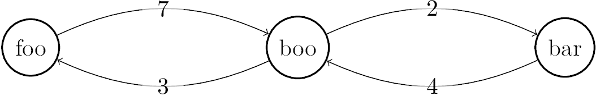

[](https://classroom.github.com/a/NehM89hy)
# Augmenting Paths

When we talked about the Ford-Fulkerson algorithm to find the maximum flow
through a graph, I mentioned the "find an augmenting path" function. You're
going to implement this function. Start with the template I provided in
`code.js`. Use an adjacency list data structure to represent the graph and node
names, not indices, to indicate start and end node. The function returns a list
of node names, starting with the start node and finishing with the end node. If
start and end node are the same, it should return a list containing only this
node. If there is no path, you must return an empty list.

Test your new function; I've provided some basic testing code in `code.test.js`.

To illustrate, here's an example graph:


Here's the call for this graph:

```javascript
var graph = {'foo': {'boo': 7},
             'boo': {'foo': 3, 'bar': 2},
             'bar': {'boo': 4}};
augmentingPath(graph, 'foo', 'bar');
```

The call would return `['foo', 'boo', 'bar']`.

Feel free to use other data structures, but you'll have to change the test code
accordingly.

## Runtime Analysis

What is the worst-case big $\Theta$ complexity of your implementation? Add your answer, including your reasoning, to this markdown file.

### Answer

#### TL;DR 

`augmentingPath` $\in \mathrm{\Theta}(|V| + |E|)$

#### Reasoning

Our implementation of `augmentingPath` only has two distinct *non-constant* components within it. The first of which being the `while` loop that will iterate until the `queue` of vertices becomes empty. In the worst case, the `while` loop will have to iterate through *every* vertex in the input graph before it can viably return a result. We know from lecture and the previous graph exercises that iterating through every vertex in an adjacency **list** takes $\mathrm{\Theta}(|V|)$ time to complete where $|V|$ represents the arbitrary number of vertices in the input graph.

The second and final *non-constant* aspect of our `augmentingPath` implementation is the nested `for...of` loop in the previously analyzed `while` loop. The `for...of` loop is iterating through *every edge* of the current vertex (`node`). Once again, the worst case scenario is when the `for...of` loop will have to consider **every** edge for **every** vertex in the graph, or simply every edge in the input graph. We know that the runtime complexity of considering every edge in an adjacency *list* is $\mathrm{\Theta}(|E|)$.

Finally, we need to consider the relationship between the `while` and `for...of` loops in our implementation. Despite the fact that the `for...of` loop is nested within the `while` loop, the comprehensive worst case time complexity is **not** $\mathrm{\Theta}(|V| * |E|)$. The reason for that is because `augmentingPath` doesn't consider every edge in the *entire graph* for each vertex. Instead, it considers every edge connected to the *current vertex* being considered. Therefore, the worst case is when every vertex is eventually parsed, **AND** every edge connected to each vertex is also considered. This means that the total number of vertices $|V|$ and the total number of edges $|E|$ would be considered in the worst case. Since it is impossible to determine whether $|V| > |E|$ or $|E| > |V|$ for any arbitrary graph, we must conclude that the worst case runtime of our `augmentingPath` implementation is $\mathrm{\Theta}(|V| + |E|)$.
